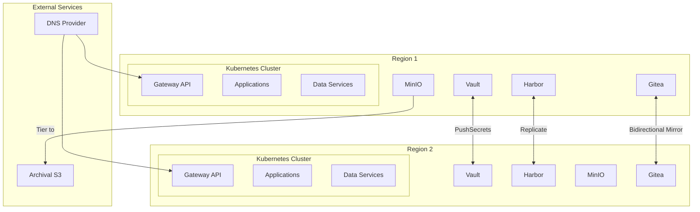
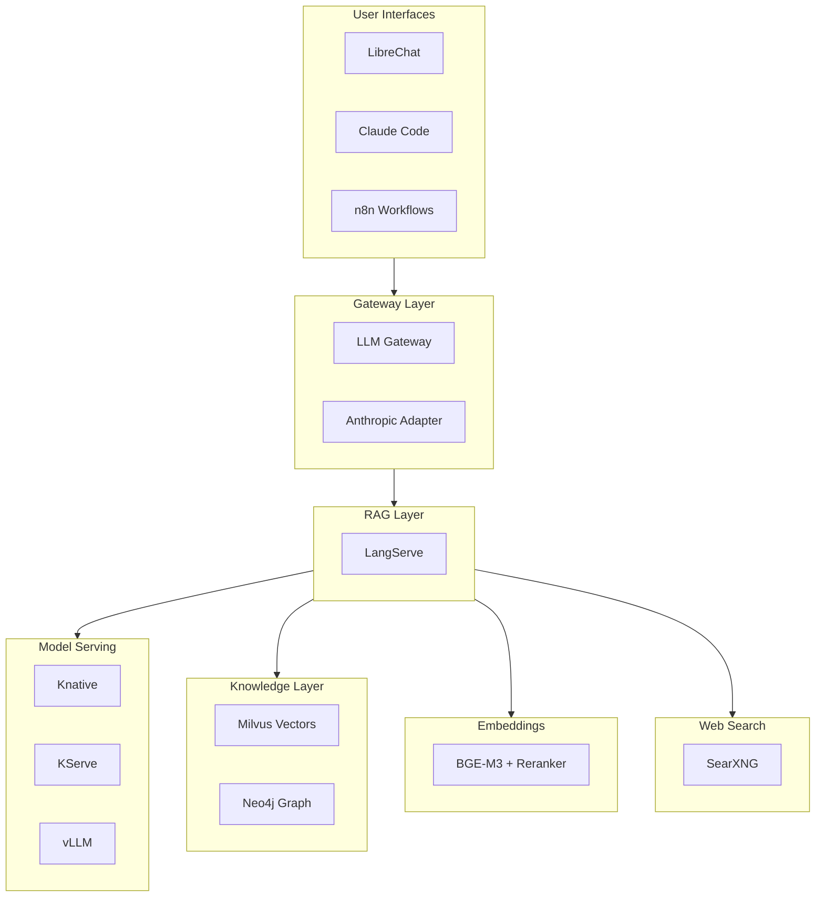
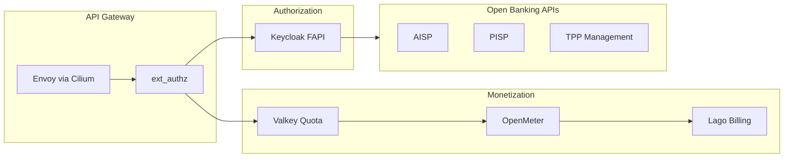
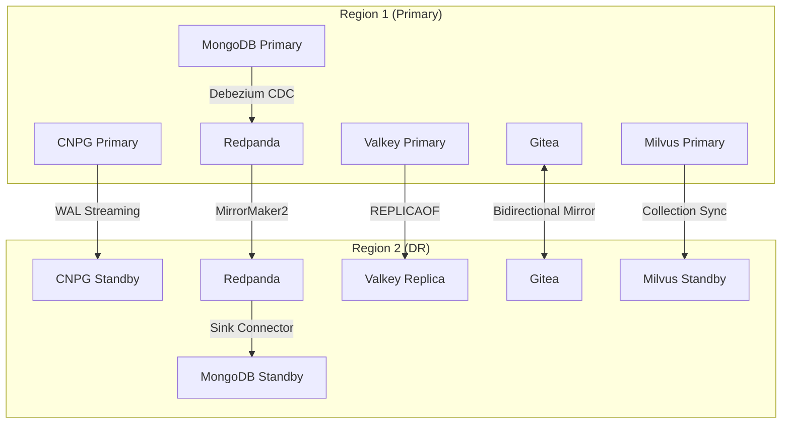

# Platform Technology Stack

Technology stack for the OpenOva Kubernetes platform.

**Status:** Accepted | **Updated:** 2026-02-08

---

## Overview

Components are categorized as **Mandatory** (always installed), **A La Carte** (optional services), and **Meta Blueprints** (vertical solutions bundling components with custom services).

---

## Architecture Overview



---

## Mandatory Components

### Infrastructure & Provisioning

| Component | Purpose | Repository |
|-----------|---------|------------|
| Terraform | Bootstrap IaC (initial cluster only) | [terraform](https://github.com/openova-io/terraform) |
| Crossplane | Day-2 cloud resource provisioning | [crossplane](https://github.com/openova-io/crossplane) |

### Networking & Service Mesh

| Component | Purpose | Repository |
|-----------|---------|------------|
| Cilium | CNI + Service Mesh (eBPF, mTLS, L7) | [cilium](https://github.com/openova-io/cilium) |
| Coraza | WAF (OWASP CRS) | - |
| ExternalDNS | DNS sync to provider | [external-dns](https://github.com/openova-io/external-dns) |
| k8gb | GSLB (authoritative DNS) | [k8gb](https://github.com/openova-io/k8gb) |

### GitOps, Git & IDP

| Component | Purpose | Repository |
|-----------|---------|------------|
| Flux | GitOps engine | [flux](https://github.com/openova-io/flux) |
| Gitea | Internal Git + CI/CD | [gitea](https://github.com/openova-io/gitea) |
| Backstage | Developer portal | [backstage](https://github.com/openova-io/backstage) |

### Security

| Component | Purpose | Repository |
|-----------|---------|------------|
| cert-manager | TLS certificates | [cert-manager](https://github.com/openova-io/cert-manager) |
| External Secrets (ESO) | Secrets operator | [external-secrets](https://github.com/openova-io/external-secrets) |
| Vault | Secrets backend (per cluster) | [vault](https://github.com/openova-io/vault) |
| Kyverno | Policy engine | [kyverno](https://github.com/openova-io/kyverno) |
| Trivy | Security scanning | [trivy](https://github.com/openova-io/trivy) |

### Scaling

| Component | Purpose | Repository |
|-----------|---------|------------|
| VPA | Vertical autoscaling | [vpa](https://github.com/openova-io/vpa) |
| KEDA | Event-driven horizontal autoscaling | [keda](https://github.com/openova-io/keda) |

### Observability

| Component | Purpose | Repository |
|-----------|---------|------------|
| Grafana Alloy | Telemetry collector | [grafana](https://github.com/openova-io/grafana) |
| Loki | Log aggregation | [grafana](https://github.com/openova-io/grafana) |
| Mimir | Metrics storage | [grafana](https://github.com/openova-io/grafana) |
| Tempo | Distributed tracing | [grafana](https://github.com/openova-io/grafana) |
| Grafana | Visualization | [grafana](https://github.com/openova-io/grafana) |
| OpenTelemetry | Application tracing | - |

### Storage & Registry

| Component | Purpose | Repository |
|-----------|---------|------------|
| Harbor | Container registry + Trivy | [harbor](https://github.com/openova-io/harbor) |
| MinIO | Object storage | [minio](https://github.com/openova-io/minio) |
| Velero | Backup/restore | [velero](https://github.com/openova-io/velero) |

### Failover & Resilience

| Component | Purpose | Repository |
|-----------|---------|------------|
| Failover Controller | Failover orchestration | [failover-controller](https://github.com/openova-io/failover-controller) |

---

## User Choice Options

### Cloud Provider

| Provider | Status | Crossplane Provider |
|----------|--------|---------------------|
| Hetzner Cloud | Available | hcloud |
| Huawei Cloud | Coming | huaweicloud |
| Oracle Cloud | Coming | oci |
| AWS | Coming | aws |
| GCP | Coming | gcp |
| Azure | Coming | azure |

### Regions

| Option | Description |
|--------|-------------|
| 1 region | Allowed (no DR) |
| 2 regions | Recommended (multi-region DR) |

### LoadBalancer

| Option | How It Works | Cost |
|--------|--------------|------|
| Cloud Provider LB | Native LB | ~€5-10/mo |
| k8gb DNS-based LB | Gateway API + k8gb | Free |
| Cilium L2 Mode | ARP-based (same subnet) | Free |

### DNS Provider

| Provider | Availability |
|----------|--------------|
| Cloudflare | Always |
| Hetzner DNS | If Hetzner chosen |
| AWS Route53 | If AWS chosen |
| GCP Cloud DNS | If GCP chosen |
| Azure DNS | If Azure chosen |

### Archival S3 Storage

| Provider | Availability |
|----------|--------------|
| Cloudflare R2 | Always (zero egress) |
| AWS S3 | If AWS chosen |
| GCP GCS | If GCP chosen |
| Azure Blob | If Azure chosen |

---

## A La Carte Data Services

| Component | Purpose | DR Strategy | Repository |
|-----------|---------|-------------|------------|
| CNPG | PostgreSQL | WAL streaming | [cnpg](https://github.com/openova-io/cnpg) |
| MongoDB | Document database | CDC via Debezium | [mongodb](https://github.com/openova-io/mongodb) |
| Redpanda | Event streaming | MirrorMaker2 | [redpanda](https://github.com/openova-io/redpanda) |
| Valkey | Redis-compatible cache | REPLICAOF | [valkey](https://github.com/openova-io/valkey) |

---

## A La Carte Communication

| Component | Purpose | Repository |
|-----------|---------|------------|
| Stalwart | Email server | [stalwart](https://github.com/openova-io/stalwart) |
| STUNner | WebRTC gateway | [stunner](https://github.com/openova-io/stunner) |

---

## Meta Blueprints

Meta blueprints bundle a la carte components with custom services for specific verticals.

### AI Hub

Enterprise AI platform with LLM serving, RAG, and intelligent agents.



#### AI Hub Components

| Component | Purpose | Type | Repository |
|-----------|---------|------|------------|
| **ai-hub** | Meta blueprint | Blueprint | [ai-hub](https://github.com/openova-io/ai-hub) |
| **llm-gateway** | Subscription proxy for Claude Code | Custom | [llm-gateway](https://github.com/openova-io/llm-gateway) |
| **anthropic-adapter** | OpenAI ↔ Anthropic translation | Custom | [anthropic-adapter](https://github.com/openova-io/anthropic-adapter) |
| knative | Serverless platform | A La Carte | [knative](https://github.com/openova-io/knative) |
| kserve | Model serving | A La Carte | [kserve](https://github.com/openova-io/kserve) |
| vllm | LLM inference (PagedAttention) | A La Carte | [vllm](https://github.com/openova-io/vllm) |
| langserve | LangChain RAG service | A La Carte | [langserve](https://github.com/openova-io/langserve) |
| milvus | Vector database | A La Carte | [milvus](https://github.com/openova-io/milvus) |
| neo4j | Graph database | A La Carte | [neo4j](https://github.com/openova-io/neo4j) |
| librechat | Chat UI | A La Carte | [librechat](https://github.com/openova-io/librechat) |
| n8n | Workflow automation | A La Carte | [n8n](https://github.com/openova-io/n8n) |
| searxng | Privacy-respecting web search | A La Carte | [searxng](https://github.com/openova-io/searxng) |
| bge | Embeddings + reranking | A La Carte | [bge](https://github.com/openova-io/bge) |

#### AI Hub Resource Requirements

| Component | Replicas | CPU | Memory | GPU |
|-----------|----------|-----|--------|-----|
| vLLM | 1 | 4 | 32Gi | 2x A10 |
| BGE-M3 | 1 | 2 | 4Gi | 1x A10 |
| BGE-Reranker | 1 | 1 | 2Gi | 1x A10 |
| Milvus | 3 | 2 | 8Gi | - |
| Neo4j | 1 | 2 | 4Gi | - |
| LangServe | 2 | 1 | 2Gi | - |
| LibreChat | 2 | 0.5 | 1Gi | - |
| LLM Gateway | 2 | 0.25 | 512Mi | - |
| **Total** | - | ~15 | ~55Gi | 4x A10 |

### Open Banking

Fintech sandbox with PSD2/FAPI compliance.



#### Open Banking Components

| Component | Purpose | Type | Repository |
|-----------|---------|------|------------|
| **open-banking** | Meta blueprint | Blueprint | [open-banking](https://github.com/openova-io/open-banking) |
| keycloak | FAPI Authorization Server | A La Carte | [keycloak](https://github.com/openova-io/keycloak) |
| openmeter | Usage metering | A La Carte | [openmeter](https://github.com/openova-io/openmeter) |
| lago | Billing and invoicing | A La Carte | [lago](https://github.com/openova-io/lago) |

---

## Cluster Deployment

### K3s Installation

```bash
curl -sfL https://get.k3s.io | sh -s - server \
  --cluster-init \
  --disable traefik \
  --disable servicelb \
  --disable local-storage \
  --flannel-backend=none \
  --disable-network-policy \
  --kube-controller-manager-arg="node-monitor-period=5s" \
  --kube-controller-manager-arg="node-monitor-grace-period=20s" \
  --kube-apiserver-arg="default-watch-cache-size=50" \
  --etcd-arg="quota-backend-bytes=1073741824" \
  --kubelet-arg="max-pods=50"
```

### Disabled K3s Components

| Component | Replacement |
|-----------|-------------|
| traefik | Gateway API (Cilium) |
| servicelb | DNS-based failover (k8gb) |
| local-storage | Application-level replication |
| flannel | Cilium CNI |

### Cilium Installation

```bash
helm install cilium cilium/cilium \
  --namespace kube-system \
  --set kubeProxyReplacement=true \
  --set k8sServiceHost=${API_SERVER_IP} \
  --set k8sServicePort=6443 \
  --set hubble.enabled=true \
  --set hubble.relay.enabled=true \
  --set encryption.enabled=true \
  --set encryption.type=wireguard \
  --set gatewayAPI.enabled=true \
  --set envoy.enabled=true
```

---

## Resource Estimates

### Core Platform (Per Region)

| Category | Components | Estimated RAM |
|----------|------------|---------------|
| Core Platform | Cilium, Flux, ESO, Kyverno | ~2GB |
| Observability | Grafana Stack + Alloy | ~3GB |
| Storage | Harbor, MinIO, Velero | ~4GB |
| Security | Vault, cert-manager, Trivy | ~1GB |
| Git & IDP | Gitea, Backstage | ~2GB |
| **Minimum Total** | | ~12GB |

**Recommended minimum:** 3 nodes × 8GB RAM = 24GB per region

### With AI Hub (Per Region)

| Category | Components | Estimated RAM | GPU |
|----------|------------|---------------|-----|
| Core Platform | (as above) | ~12GB | - |
| AI Hub | LLM Gateway, LangServe, etc. | ~55GB | 4x A10 |
| **Total** | | ~67GB | 4x A10 |

**Recommended:** 3 CPU nodes + 2 GPU nodes per region

---

## Multi-Region Data Flow



---

*Part of [OpenOva](https://openova.io)*
